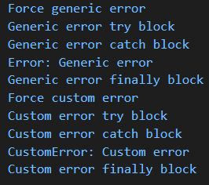

## Purpose

- Practice cloning GitHub repository to local system and pushing changes back to GitHub
- Use CLI to create branches and add new files and make changes to existing files
- Practice error handling by experiment with try..catch..finally, throw and creating own custom error class.

Output of custom error class  
  

[GitHub repository created during lab](https://github.com/UO-CIT-jiah/cit281-lab7)

